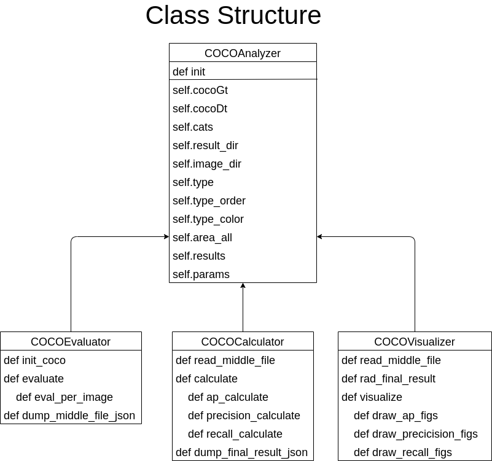

# analytical_map

Calculate mAP in respect to categories, boounding box size.


## Requirements

## Preparation
- Clone
```
git clone https://github.com/RyotaYoneyama/analytical_map.git
cd analytical_map
```

- docker
```
xhost+
chmod +x docker/entrypoint.sh
docker build -t analytical_map -f docker/Dockerfile .
docker run --rm -it --privileged --net=host --ipc=host \
    -v $PWD:/home/$(id -un)/analytical_map/ \
    -v /tmp/.X11-unix:/tmp/.X11-unix \
    -e DISPLAY=$DISPLAY \
    -v $HOME/.Xauthority:/home/$(id -un)/.Xauthority \
    -e XAUTHORITY=/home/$(id -un)/.Xauthority \
    -e DOCKER_USER_NAME=$(id -un) \
    -e DOCKER_USER_ID=$(id -u) \
    -e DOCKER_USER_GROUP_NAME=$(id -gn) \
    -e DOCKER_USER_GROUP_ID=$(id -g) \
    analytical_map bash

cd analytical_map
```

## Usage


### Evaluate 
Count all TPs, FPs, FNs and categorize them followings:
- TPs->'Match', 
- FPs, FNs->'DC (Double Count)', 'Cls (Class mistake)', 'Loc(Location)', 'Bkg (Background)', 'LC (Less Count)', 'Miss'.

```
python3 -m analytical_map.cocoEvaluator
```
The above command will create the middle file named 'example/results/middle_file.json'.

### Calculate APs, precision, and recall 
From the middle file, the following command creates the final results named 'example/results/final_results.json' containing scores of AP, precision, and recall.
```
python3 -m analytical_map.cocoCalculator
```

### Visualize the final results and middle file.
Visualize the final results and middle file in 'example/results/figures' and 'example/results/draw_bbs'. 
```
python3 -m analytical_map.cocoVisualizer
```


### Evaluate & Analyze & Visualize
If you would like to execute the above two steps, you can run them by follwoings:
```
python3 -m analytical_map.cocoAnalyzer
```

## Use flow chart


## Class structure
 


## The structure of middle file and final results
### Middle file
- It is based on COCO format.
- Ground truth is 'annotations' and detections is 'detections'.
- Evaluations of ground truth and detections are added  as 'eval'.
- 'eval' is composed of
  - count:TP or FP or FN
  - type:"Match" or "DC" or "LC" or "Cls" or "Loc" or "Miss" or "Bkg"
  - corr_id: ID of corresponding bounding boxes.
  - iou:Intersect of Union.
- The example is following:

{  
  "licenses": "",  
  "info": "",  
  "categories": [*Category information*]  
  "images": [*Image information*]  
  "annotations"(*Ground truth*): [ 
    {  
      "id": Object id,  
      "image_id": image id,  
      "category_id": 1,  
      "segmentation": [],  
      "area": 45914.4567,  
      "bbox": [  
        top_x,  
        top_y,  
        bb_width,  
        bb_height  
      ],   
      "iscrowd": 0,  
      "attributes": {  
        "occluded": false,  
        "rotation": 0.0  
      },  
      "eval": {  
        "count": "TP" or "FP" or "FN",  
        "type": "Match" or "DC" or "LC" or "Cls" or "Loc" or "Miss" or "Bkg",  
        "corr_id": ,
        "iou":  
      }  
    }, ...],  
  "detections"(*Detections*): [Same structure with annotations]  
  }

### Final results
Final results is composed of
- params:
  - iou_thresh:IoU threshold
  - iou_loc:IoU threshold for evaluating location error('Loc').
  - recall_inter: Points of recall to calculate average precision.
  - area_rng: Area range, [0, 10000000000] is for all ranges.
- results
  - precision
    - category
    - score
    - ratio: The ratio of types.
  - recall
    - category
    - score
    - ratio
  - ap
    - category
    - area
    - ap
    - ratio
    - score : probability of inference.
    - recall_raw: Raw data of recall.
    - prec_raw: Raw data of precision
    - recall_inter: Points of recalls for calculating AP.
    - prec_inter: Modified precision for calculating AP.


## Directory structures
analytical_map  
- analytical_map : Source codes
  - cocoEvalutor.py： Evaluates every images, counts TPs, FPs and FNs, and divide them into {'Match', 'DC', 'LC', 'Cls', 'Loc', 'Bkg', 'Miss'｝.The evaluation is summarized into a middle file.
  - cocoCalculator.py：From the middle file, calculates AP, precison, and recall. The calculation is summarized into the final results. 
  - cocoVisualizer.py：Visualized the the final results.
  - cocoAnalyzer.py：Inherits COCOEvaluator, COOCCalculator, and COCOVivsualizer, and run them together.
  - params.py：Parameters for the evaluation and calculation.
  - tools：
    - draw_chart.py：Tools for drawing charts.
    - dump_json.py：Tools for outputting a middle file and final results.
- debug : For debugging.
- docs : sphinx
- docker :   
- example:
  - data：Sample data.
  - results：Results
- README.md : README.md


## Details
* [README_JP](README_JP.md)
* [eval_per_image flow chart](docs/figures/eval_per_image_flow.drawio.png) 
* [API](https://ryotayoneyama.github.io/analytical_map/)


## Requirements
- pycocotools==2.0.4
- numpy
- opencv-python
- nptyping
- bokeh
  
## TODO
* [x] Replacing matplotlib with bokeh.
* [ ] Draw AP in respect to object positions.
* [ ] Draw time-precision, time-recall graphes.
* [ ] Evaluate this pkg with another mAP tools.
* [ ] Pip
* [ ] Added some cool figures on top.
## Project status
In progress
