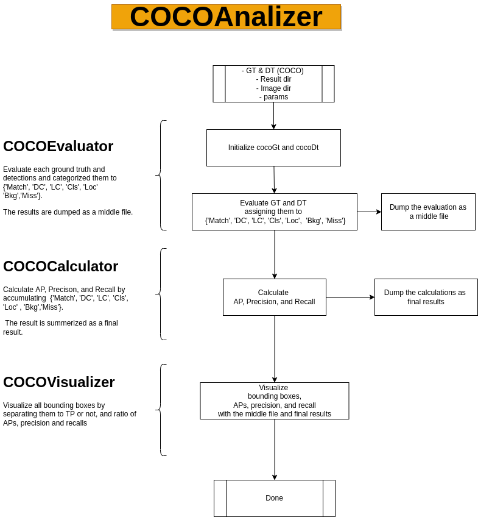

# analytical_map

Calculate mAP in respect to categories, boounding box size.


## Requirements

## Preparation
- Clone
```
git clone https://github.com/RyotaYoneyama/analytical_map.git
cd analytical_map
```

- docker
```
xhost+
chmod +x docker/entrypoint.sh
docker build -t analytical_map -f docker/Dockerfile .
docker run --rm -it --privileged --net=host --ipc=host \
    -v $PWD:/home/$(id -un)/analytical_map/ \
    -v /tmp/.X11-unix:/tmp/.X11-unix \
    -e DISPLAY=$DISPLAY \
    -v $HOME/.Xauthority:/home/$(id -un)/.Xauthority \
    -e XAUTHORITY=/home/$(id -un)/.Xauthority \
    -e DOCKER_USER_NAME=$(id -un) \
    -e DOCKER_USER_ID=$(id -u) \
    -e DOCKER_USER_GROUP_NAME=$(id -gn) \
    -e DOCKER_USER_GROUP_ID=$(id -g) \
    analytical_map bash

cd analytical_map bash
```

## Usage

### Evaluate & Analyze & Visualize
If you would like to execute the above two steps, you can run them by follwoings:
```
python3 -m example.minimum_example COCO_GT_FILE_PATH COCO_DT_FILE_PATH RESULT_DIR IMAGE_DIR
```
For example,
```
python3 -m example.minimum_example example/data/coco/gt.json example/data/coco/dt.json example/results/ example/data/images/
```
### Evaluate every images and dump the evaluation as a middle file.
Count all TPs, FPs, FNs and categorize them followings:
- TPs->'Match', 
- FPs, FNs->'DC (Double Count)', 'Cls (Class mistake)', 'Loc(Location)', 'Bkg (Background)', 'LC (Less Count)', 'Miss'.

```
python3 -m analytical_map.cocoEvaluator
```
The above command will create the middle file named 'example/results/middle_file.json'.

### Calculate APs, precision, and recall from the middle file.
Create the final results named 'example/results/final_results.json' containing scores of AP, precision, and recall.
```
python3 -m analytical_map.cocoCalculator
```

### Visualize the final result and middle file.
Visualize the final results and middle file in 'example/results/figures' and 'example/results/draw_bbs'. 
```
python3 -m analytical_map.cocoVisualizer
```


## Use flow chart


## Details
* [README_JP](README_JP.md)
* [API](https://ryotayoneyama.github.io/analytical_map/)


## Project status
In progress
