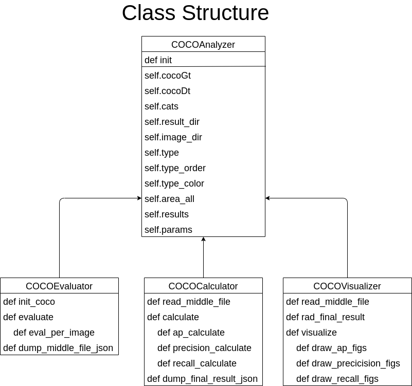

# はじめに
本書は、社内の物体検出の評価基準であるmAPを計算するスクリプトである。特に下記の特徴をもつ。
- mAPを計算する。
- mAPを物体のバウンディングボックス（BB）ごとに計算する。
- TP、 FP、FNを｛'Match', 'DC', 'LC', 'Cls', 'Loc', 'Bkg', 'Miss'｝の7つのタイプに分類でき、検出の失敗を分析できる。
- COCOのフォーマットに準ずることで、新たなデータ構造の学習が少ない。
## 背景
- 物体検出の精度評価としてAverage Presicion (AP) が社内外を含めて広く使われている。
- 現在はOSSのコードを利用してAPを計算している。
- しかしOSSしコードの保守性・拡張性が必ずしも高くなく，追加実装が困難である。
- 例えば物体の大きさごとに，未検出・ご検出・重複カウントなどを評価したい場合，ドキュメントが少ないOSSのコードを理解して実装する必要がある。
- そこで自社で実装することにより，コードの安全性・保守性・拡張性が高いAPを計算するライブラリの開発を目指す。
## analytical_map基本方針  
* 入力はCOCOフォーマットとする。他フォーマットに関しては変換コードを用いる。
* analytical_map cocoAnalyzerを最上位とするクラス構成とする。
* COCOAnalyzerはCOCOEvaluator、 COCOCalculator、 COCOVisualizerの3段構成となっている。
  * COCOEvaluatorでは，バウンディングボックスを分類する。
    * eval:バウンディングボックスの分類は{'TP', 'FP'，'FN'}のカウント分類と，それらを細分化した｛'Match', 'DC', 'LC', 'Cls', 'Loc', 'Bkg', 'Miss'｝のタイプに分類する。
    * タイプの優先順位は　'Match'>'DC'=LC'>Cls'>'Loc'>'Bkg'='Miss'とする。
    * 同タイプでの優先順位はscore順とする。
    * 上記分類を中間ファイル（Middle file）として出力する。
  * COCOCalculatorでは上記中間ファイルをもとに，タイプごとのAP、Precision、Recallを計算し最終結果（Final result）を出力する。
    * APの計算方法はPascal VOCを基本とする。
  * COCOVisualizerでは上記最終結果をもとにグラフ，バウンディングボックス付き画像を出力する。
 
# 参考資料
 

* [API](https://ryotayoneyama.github.io/analytical_map/)
* [README](README.md)
  
# ソースコード
ディレクトリ階層を下記する。  
analytical_map  
- analytical_map : ソースコード
  - cocoAnalyzer.py：物体検出分析クラス，最上位
  - cocoEvalutor.py：カウント分類，タイプ分類を行う評価クラス
  - cocoCalculator.py：上記カウント分類，タイプ分類結果からAP、Precision，Recallを計算するクラス
  - cocoVisualizer.py：AP、Precision、Recall結果からグラフを作成するクラス
  - params.py：上記Evaluation、 Calculationを行うためのパラメータdataclass
  - tools：ツール
    - draw_chart.py：グラフ描画用ツール
    - dump_json.py：内部データ出力用ツール
- debug : デバッグ用ツールおよび描画結果
- docs : sphinx
- docker : Dockerfile  
- example:サンプル
  - minimum_example.py：サンプルコード
  - data：サンプルデータ
  - results：サンプル結果
- README.md : README.md

# 基本設計
## クラス図概観
 

## The structure of middle file and final results
### Middle file
- It is based on COCO format.
- Ground truth is 'annotations' and detections is 'detections'.
- Evaluations of ground truth and detections are added  as 'eval'.
- 'eval' is composed of
  - count:TP or FP or FN
  - type:"Match" or "DC" or "LC" or "Cls" or "Loc" or "Miss" or "Bkg"
  - corr_id: ID of corresponding bounding boxes.
  - iou:Intersect of Union.
- The example is following:

{  
  "licenses": "",  
  "info": "",  
  "categories": [*Category information*]  
  "images": [*Image information*]  
  "annotations"(*Ground truth*): [ 
    {  
      "id": Object id,  
      "image_id": image id,  
      "category_id": 1,  
      "segmentation": [],  
      "area": 45914.4567,  
      "bbox": [  
        top_x,  
        top_y,  
        bb_width,  
        bb_height  
      ],   
      "iscrowd": 0,  
      "attributes": {  
        "occluded": false,  
        "rotation": 0.0  
      },  
      "eval": {  
        "count": "TP" or "FP" or "FN",  
        "type": "Match" or "DC" or "LC" or "Cls" or "Loc" or "Miss" or "Bkg",  
        "corr_id": ,
        "iou":  
      }  
    }, ...],  
  "detections"(*Detections*): [Same structure with annotations]  
  }

### Final results
Final results is composed of
- params:
  - iou_thresh:IoU threshold
  - iou_loc:IoU threshold for evaluating location error('Loc').
  - recall_inter: Points of recall to calculate average precision.
  - area_rng: Area range, [0, 10000000000] is for all ranges.
- results
  - precision
    - category
    - score
    - ratio: The ratio of types.
  - recall
    - category
    - score
    - ratio
  - ap
    - category
    - area
    - ap
    - ratio
    - score : probability of inference.
    - recall_raw: Raw data of recall.
    - prec_raw: Raw data of precision
    - recall_inter: Points of recalls for calculating AP.
    - prec_inter: Modified precision for calculating AP.

# 詳細設計
sphinxで生成した[API](https://ryotayoneyama.github.io/analytical_map/)を参照のこと。  
ただしCOCOEvaluate.eval_per_image()については下記のフローチャートを参照。
 

# Requirements
下記参照
[README](README.md)
# デモ
下記参照
[README](README.md)

# TODO
下記参照
[README](README.md)
